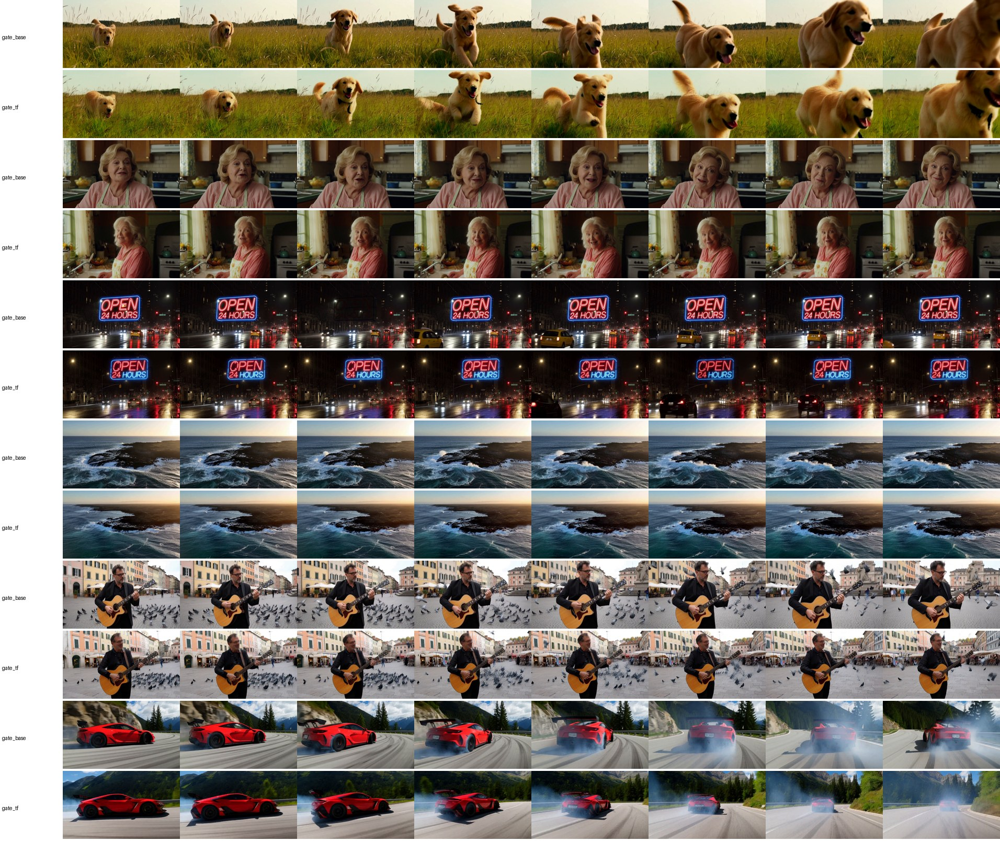

Follow me on X for more updates: https://x.com/jayleaton

Support me here: https://buymeacoffee.com/jayleaton

# MiniMax H3 on TensorFold kernels, one RTX 5070 Ti (native Windows)

A faster way to run the MiniMax H3 audio-video model in ComfyUI: a drop-in loader node that runs H3's 19B-parameter
DiT on [TensorFold](https://github.com/ashhart/TensorFold)'s NVFP4 W4A4 tensor-core GEMMs with 8-bit attention,
instead of ComfyUI's int8 weights streamed through a bf16 attention path. Your workflow, text encoder, sampler,
guides and both VAEs stay exactly as they are; you swap `Load Diffusion Model` for **TensorFold MiniMax H3 Loader**.
LoRA nodes (the blueprint's Lightning / Turbo switch) and ComfyUI's Model Sparse Attention node keep working.

The engine (`tfvideo/`) is new: it keeps ComfyUI's own `MiniMaxH3Model` for everything around the transformer
(packing the [text | keyframes | audio | video] sequence, per-token timesteps, RoPE, the PDD output heads) and
replaces only its 50 blocks. TensorFold is used as a pinned, unmodified submodule.

> **Work in progress.** Measured on one desktop (RTX 5070 Ti 16 GB, Blackwell sm_120, Windows 11, 64 GB RAM).
> Knobs, defaults and numbers may change between commits. NVFP4 changes fine detail and, on some prompts, the
> composition: read [Quality](#quality) before relying on it.

SPDX-License-Identifier: Apache-2.0 (this project's own code, scripts, benchmarks and docs; see [Licensing](#licensing)).

## Results

Same ComfyUI (0.37.0, torch 2.10+cu130), same workflow and settings as the "Image to Video (MiniMax H3)" blueprint:
text-to-video+audio, 1344x768, 5 s (124 frames), 24 fps, res_multistep, simple schedule, no CFG; Qwen3-VL 32B NVFP4
text encoder, fp16 video VAE, fp32 audio VAE. Baseline: the stock `minimax_h3_fl2va_pruned_int8_convrot` checkpoint
through ComfyUI's loader. Warm runs (models resident in RAM), new seed, end to end (sampling, both VAE decodes, mp4):

| 1344x768, 5 s video + audio | s / step | **seconds per video** | vs stock |
| --- | ---: | ---: | ---: |
| Stock ComfyUI, 20 steps | 28.3 | 623 | 1x |
| Stock + `--use-ck-attention` (INT8 attention), 20 steps | 14.4 | 335 | 1.9x |
| **This (NVFP4), 20 steps** | **11.7** | **273** | **2.3x** |
| **This + ComfyUI's sparse attention node (sol-attn, tau 1.3), 20 steps** | 11.7 dense / ~6.4 sparse | **192** | **3.2x** |
| Stock + ck-attention + Turbo LoRA (8 steps) | 14.8 | 167 | 3.7x |
| **This + Turbo LoRA, 8 steps** | **11.65** | **133** | **4.7x** |
| **This + Turbo LoRA + sparse attention, 8 steps** | | **96** | **6.5x** |
| **... + Comfy-Org's int8 video VAE** (`minimax_h3_video_vae_int8_convrot`) | | **81** | **7.7x** |

For scale: published numbers for stock ComfyUI on an RTX 4090 with the Turbo LoRA are ~133 s for a similar 5 s clip.

Where the 81 s go (`TFVIDEO_TIME_NODES=1` logs each node): sampling 67 s (2 dense steps, 6 sparse), video VAE decode
10 s (23.9 s with the fp16 VAE: 79% of it is fp16 GEMMs, which the int8 VAE runs on int8 tensor cores), audio decode
and mp4 4 s. A new prompt adds the text encoder (~50 s the first time the 32B encoder streams in, a few seconds once
warm); the first load of the engine adds ~22 s.

At 768x448, 2 s, a new prompt each video (text encoding included): stock 62 s, this 28.5 s.

Where a step goes now (one block at 37.8k tokens, `tools/profile_block.py`): attention 66% (comfy-kitchen INT8),
NVFP4 GEMMs 28%, fused elementwise 6%. Full baseline, profile, per-lever numbers: [`docs/RESULTS.md`](docs/RESULTS.md).

## Quality

NVFP4 is "same prompt, different sample": six fixed-seed prompts at 768x448 (`bench/jobs_gate.json`), rendered by
stock ComfyUI and by this engine, compared frame by frame (`bench/quality.py`: 8 frames per clip, LPIPS-alex,
DINOv2-S cosine, PSNR; audio log-mel distance):

| vs stock ComfyUI | mean LPIPS | mean DINO | audio log-mel cos |
| --- | ---: | ---: | ---: |
| stock + ck-attention (768x448, one prompt, 2 seeds) | 0.146 | 0.970 | 0.984 |
| this, `int8` precision (stock weights) | 0.241 | 0.917 | 0.939 |
| this, `nvfp4` | 0.493 | 0.822 | 0.903 |



Every NVFP4 video is clean and on-prompt (the sign reads "OPEN 24 HOURS"; faces, hands, the drifting car and the
pigeons are coherent), and four of six keep the stock render's subject and staging; the rest change pose, framing
or casting. The audio is speech, music and effects of the same kind and level (spectral statistics in the same
range as stock), not identical waveforms. Sparse attention on top of NVFP4 keeps the dense engine's composition
(the first 20% of steps stay dense) and changes fine detail. Engine correctness: its bf16 path matches ComfyUI's
forward to cos 0.998-0.9998 on real captured steps (`tools/check_forward.py`).

## Use it

Requirements: an NVIDIA RTX 50-series GPU (compute capability 12.x; NVFP4 needs the block-scaled FP4 MMA), a recent
driver (tested 617.14), ComfyUI portable 0.37+ with torch 2.10+cu130 and comfy-kitchen 0.2.35, 64 GB of RAM, Visual
Studio 2022/2026 with the C++ x64 tools (to build the kernels once), Python 3.13, [uv](https://docs.astral.sh/uv/).
Step by step, with checks: [`AGENTS.md`](AGENTS.md).

```bat
git clone --recurse-submodules https://github.com/jayleaton/minimax-h3-tensorfold-rtx
cd minimax-h3-tensorfold-rtx
scripts\setup.cmd                       :: venv, NVIDIA's pip CUDA 13.4 toolkit, builds TensorFold's kernels for your GPU
```

A ready workflow: [`workflows/Image to Video (MiniMax H3, TensorFold).json`](workflows) is ComfyUI's "Image to Video
(MiniMax H3)" blueprint with the loader swapped (drag it into ComfyUI). For the fastest decode, Comfy-Org's
[`minimax_h3_video_vae_int8_convrot.safetensors`](https://huggingface.co/Comfy-Org/MiniMax-H3/tree/main/vae) goes in
`models\vae` and replaces the fp16 video VAE in the two VAE loaders.

Then make the node visible to ComfyUI, either with a directory junction
(`mklink /J "%COMFYUI_PORTABLE%\ComfyUI\custom_nodes\ComfyUI-TensorFold-Video" "%CD%\comfyui\ComfyUI-TensorFold-Video"`)
or an `extra_model_paths.yaml` entry with `custom_nodes:` pointing at `comfyui/` (needed when ComfyUI lives on an
exFAT/FAT external drive, where junctions cannot be made):

```yaml
# <ComfyUI>\extra_model_paths.yaml
tensorfold_video:
  base_path: C:/path/to/minimax-h3-tensorfold-rtx
  custom_nodes: comfyui
```

In your MiniMax H3 workflow replace `Load Diffusion Model` with **TensorFold MiniMax H3 Loader** (same file, precision `nvfp4`, attention `auto`).

The first load converts the DiT once (~2 minutes) into `%LOCALAPPDATA%\tfvideo` (11 GB; `TFVIDEO_CACHE` moves it;
keep it on an internal NVMe drive); later loads take ~15 s. A LoRA set is merged and converted once on first use.

Precisions: `nvfp4` (fastest), `int8` (the checkpoint's own int8 weights: stock numerics, engine speed-ups for
attention and memory only), `nvfp4:edge=2` (first and last two blocks FP8), `fp8`, `bf16-check` (reference, ~40 GB
of RAM). Attention: `auto` (= `int8`, comfy-kitchen's SageAttention-style kernel), `fp8` / `fp4` (this repo's
experimental Triton kernels), `sdpa` / `cudnn` (bf16).

## Limits and negatives

- **Attention is two thirds of a step** and runs on comfy-kitchen's INT8 kernel; this repo's Triton NVFP4/FP8
  attention kernels are correct but slower (135-150 TF/s vs 265). A faster dense attention needs a hand-written
  CUDA kernel (FP4 QK^T would bring ~1.5x on attention).
- **`int8` precision is RAM-hungry**: 20 GB of pinned weights push ComfyUI to evict the 15.7 GB text encoder, which
  then re-reads from disk on every new prompt (slower than stock on a 64 GB machine with models on an external
  drive). Use it only to check fidelity.
- Converted engines are 11 GB each (one per LoRA set) in `%LOCALAPPDATA%	fvideo`; set `TFVIDEO_CACHE` to put them
  elsewhere.
- The first sampling step of every run quantizes activations with exact per-call scales (host syncs); later steps
  use the previous step's range x2 (adaptive), logging when a layer clipped.
- **Determinism**: the engine is bitwise reproducible (same seed, same video) across runs and ComfyUI restarts for
  dense and LoRA workflows (`tools/check_determinism.py`, `bench/comfy_h3.py --same-seed`). ComfyUI's Model Sparse
  Attention node is not reproducible across ComfyUI restarts (stock ComfyUI too: same seed, different video after a
  restart; identical within one session).
- The Comfy-Org int8 video VAE is a stock option (it speeds up stock ComfyUI's decode the same way); it costs no
  measurable fidelity here (its difference from the fp16 VAE is below the sparse node's run-to-run noise).
- A synthetic stress test with exploding activations hung the GPU long enough for a Windows TDR (driver reset); real
  sampling never produced one in ~40 runs here.
- Not measured: image-to-video (first/last frame), reference-to-video, the Fun ControlNet patch (the engine blocks
  accept ComfyUI's block patches, untested), RTX 5080/5090, other ComfyUI versions.

## Repository

| Path | What |
| --- | --- |
| `tfvideo/` | the engine: `minimax_h3.py` (blocks, weight streaming, ComfyUI block facade), `linear.py` (NVFP4 / FP8 / int8 / bf16), `kernels.py` (fused Triton norm + modulation, gated residual, SwiGLU), `attention.py`, `fp4attn.py` (experimental FP4/FP8 Triton attention), `source.py` (int8 ConvRot reader), `store.py` (conversion, cache), `comfy_nodes.py` (loader, LoRA routing), `ext.py` (prebuilt kernels) |
| `comfyui/ComfyUI-TensorFold-Video/` | the ComfyUI custom node package |
| `bench/` | headless ComfyUI harness (blueprint graph; `--tf`, `--lora`, `--sparse`, `--vae`, `--same-seed`), ground-truth dump, video/audio quality gate |
| `workflows/` | the blueprint with the TensorFold loader |
| `tools/` | engine-vs-ComfyUI forward check, determinism check, attention benchmarks, block and VAE profilers, `env.cmd` (MSVC + pip CUDA toolkit) |
| `vendor/TensorFold` | TensorFold v0.6.1, unmodified submodule |
| `scripts/check-public.sh` | scan for private details before publishing |

## Licensing

This project's own code, scripts, benchmarks and documentation are Apache-2.0 ([`LICENSE`](LICENSE)); third-party
work keeps its own license, listed in [`NOTICE`](NOTICE). TensorFold is included as an unmodified submodule
(Apache-2.0 from 0.6.0). ComfyUI (GPL-3.0) and comfy-kitchen (Apache-2.0) are not included: the node runs inside
your ComfyUI. No model weights are included; MiniMax H3, its text encoder, VAEs and the Turbo LoRAs are downloaded by
each user under their own terms.

## Credits

[TensorFold](https://github.com/ashhart/TensorFold) by ashhart and contributors (the NVFP4 kernels this runs on);
MiniMax (H3); ComfyUI and Comfy-Org (the reference implementation, the host, comfy-kitchen's INT8 attention and
kernels); [lightx2v](https://huggingface.co/lightx2v/Minimax-h3-Turbo) (the Turbo LoRAs).
